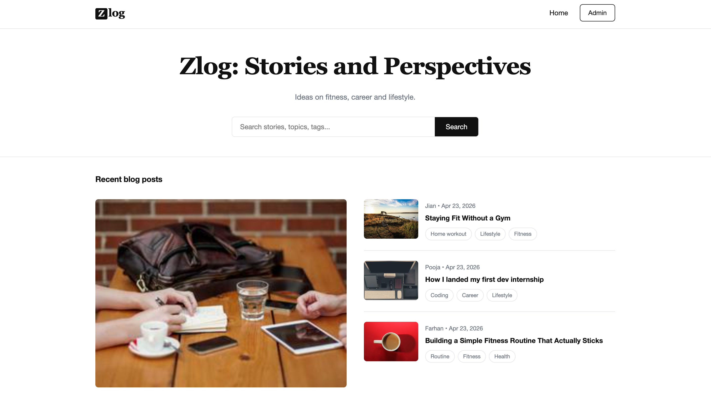
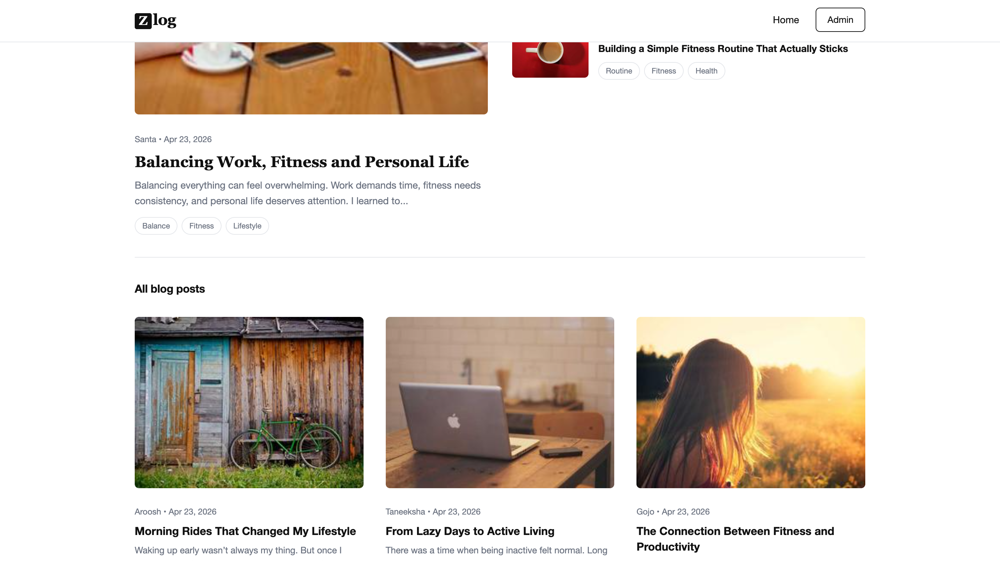
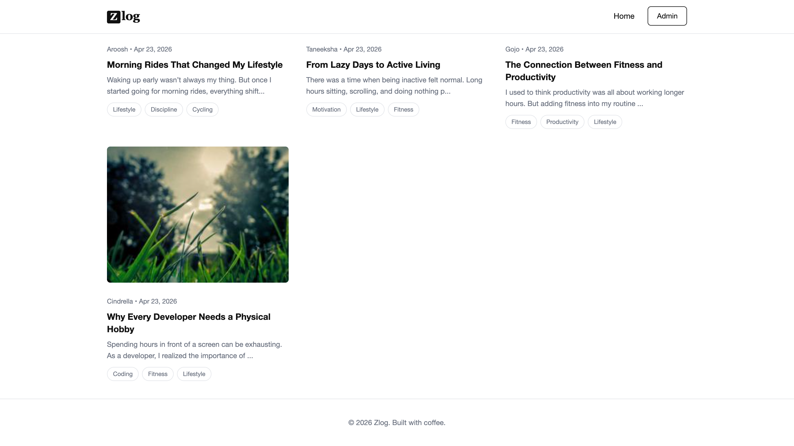
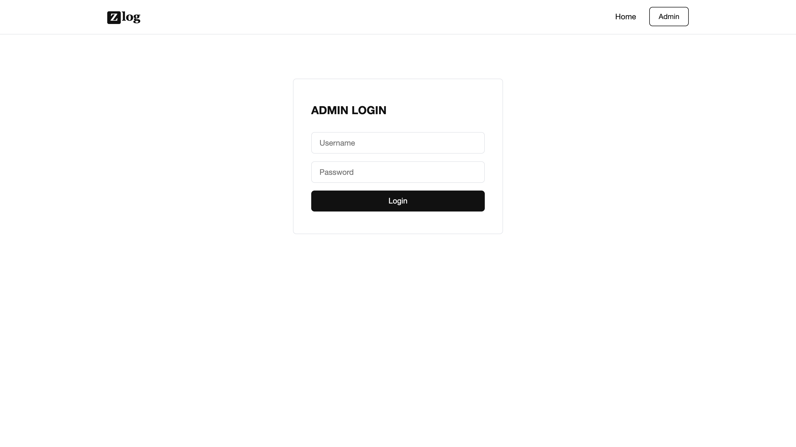
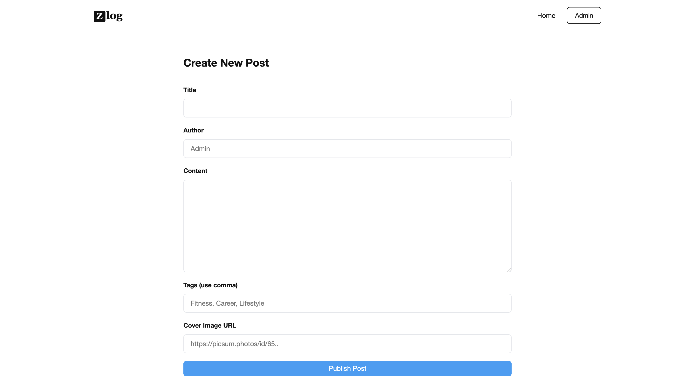
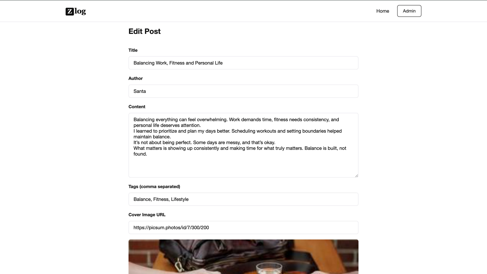
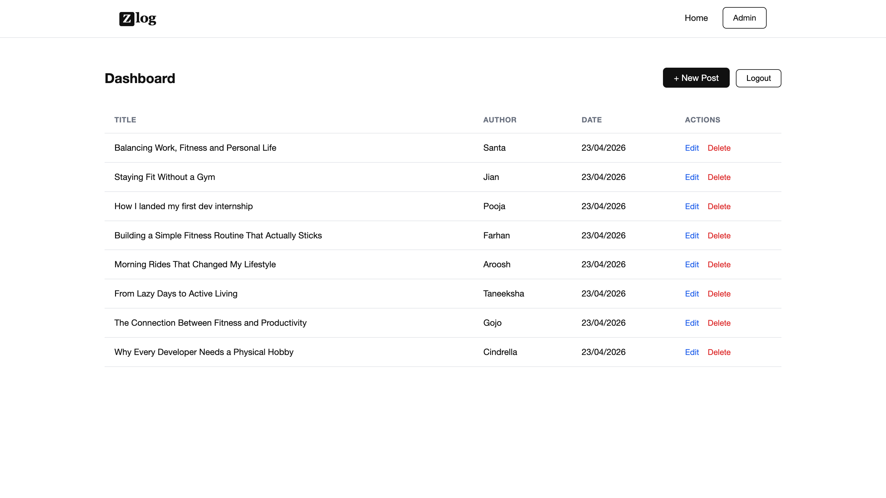

# Zlog - A Project on Blog

### Homepage

  

### Listing page

  

### Post Page

  

### Login 

  

### Create & Edit Post

  
  

### Dashboard  

  

## Tech Stack
 
| Layer | Tool |
|---|---|
| Frontend | Next.js 13, CSS |
| Backend | Next.js API Routes |
| Database | MongoDB |
| Deployment | Vercel |
 
---
## Working of CRUD
 
**Read (GET)**
1) `GET/api/posts` fetches all posts, it supports `?search=` query for title/tag filtering using MongoDB `$or` with `RegExp`
2) `GET/api/posts/[id]` fetches a single post by ID.

**Create (POST)**
1) `POST /api/posts` creates a new post but requires a valid JWT cookie to proceed.

**Update (PUT)**
1) `PUT /api/posts/[id]` updates a post by ID. It is JWT-protected.

**Delete (DELETE)**
1) `DELETE /api/posts/[id]` deletes a post and it also JWT-protected.

----
## JWT overview
 
1. When admin clicks `/login` and put username + password
2. `POST/api/auth/login` checks credentials against hardcoded values in `lib/auth.js` (`admin` / `admin123`)
3. If it is valid, a JWT will be signed using `JWT_SECRET` from `.env.local` and set as an **HttpOnly cookie** so that  JS can't touch it
4. Then protected API route will read `req.cookies.token` and call `verifyToken()` before doing anything
5. Middleware at `middleware.js` redirects unauthenticated users away from `/admin/*` routes entirely

----
## Frontend Overview
 
1) Used plain CSS in `styles/globals.css`. 
2) The layout uses CSS Grid for the featured post section and the post cards grid.
3) Have put Responsive breakpoints at `768px` and `500px` which collapse the grid to single column on mobile device
4) Fonts: Georgia (serif) for headings  & Helvetica Neue for body.
 
---
## Challenges & Learnings

1) Connecting to MongoDB without opening too many requests.

Fix: Used `isConnected` flag in `lib/db.js` which skipped connecting if its already connected.

2) Authentication flow across middleware.

Learnt: Middleware can only check for the cookie's existence and actual JWT verification has to happen inside the API route itself.

 

 
